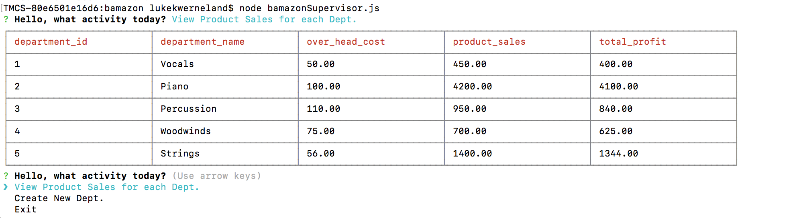

# bamazon

Bamazon is a command line structural markup for a store, "Ed's Music". It has different functionalities depending on whether the user is a Customer, Manager, or Regional Supervisor.

It utilizes the node packages inquirer, mysql, and cli-table. By answering different questions, it is possible to access data to accomplish different requests.

Customer menu

This menu allows customers to choose whether they want to purchase an item from the store or exit the "store". The app pulls data from a mysql database and populates a list of available inventory. The app calculates the amount of items purchased and the item's price and gives the customer a total. The inventory is then subtracted from the stock_quantity.

Manager menu

Managers are first presented with this main menu of options: "View Products", "View Inventory", "Add Inventory", "Add New Item". Managers are also able to add new products to the database. They are shown a list of the departments in order to add products.

Regional Supervisor application

The menu for a supervisor gives them the option to view product sales and over all profits by department. This table populates based on the database information, and calculates a temporary table called total profits.In addition to this, Supervisors are able to add a department.

CUSTOMER INTRODUCTION SCREEN

CUSTOMER PURCHASE SCREEN

INVENTORY ADD SCREEN

MANAGER INTRODUCTION SCREEN

MANAGER INVENTORY ADD SCREEN

MANAGER VIEW INVENTORY SCREEN

SUPERVISOR INTRODUCTION SCREEN

SUPERVISOR DEPARTMENT TOTAL SCREEN

DEPARTMENT ADD IN SQL

SUPERVISOR DEPT ADD SCREEN

